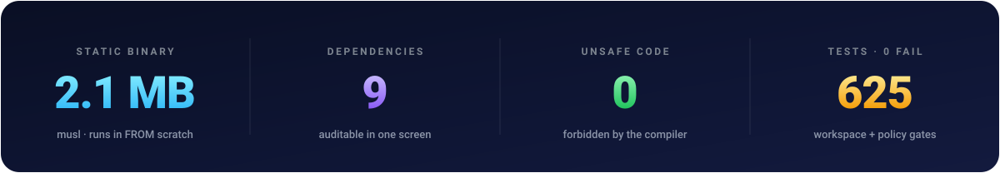
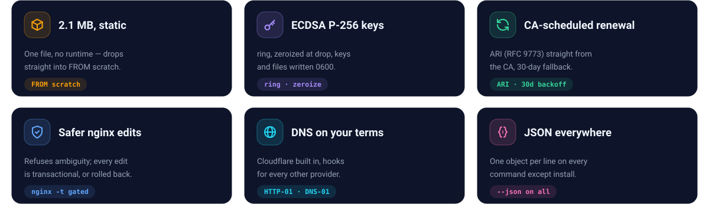
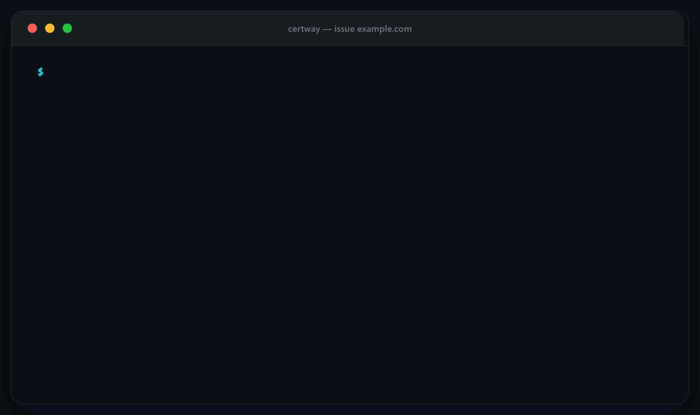
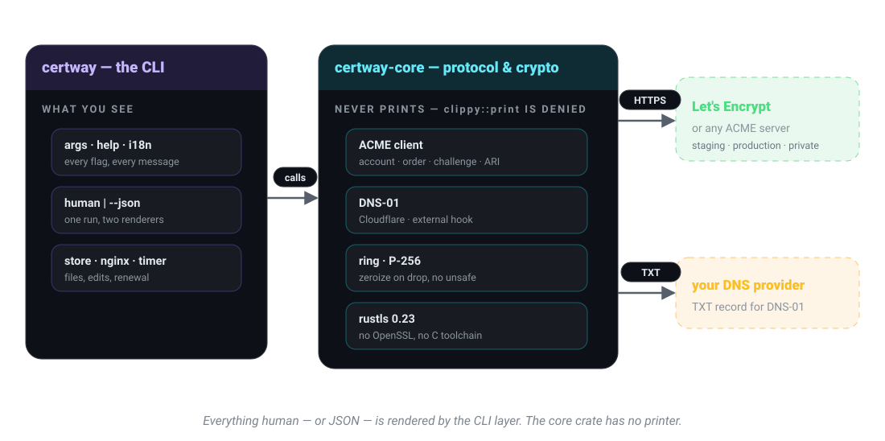

<div align="center">



<br><br>

[](https://github.com/GatewayIRAN/certway/releases)
<a href="https://github.com/GatewayIRAN/certway/actions/workflows/release.yml"></a>
[](LICENSE)


<br>

<a href="#-install"></a>
<a href="#-a-tour"></a>
<a href="#-commands"></a>
<a href="#-automatic-renewal"></a>
<a href="#-editing-nginx-without-breaking-it"></a>
<a href="#-how-it-compares"></a>
<a href="#-known-limits"></a>
<a href="#-license"></a>

</div>


<br>

certway gets a TLS certificate from Let's Encrypt — or any ACME server — onto a Linux or macOS box, and keeps it renewed. One static binary: no runtime, no Python, no OpenSSL, no daemon. `issue` once, `install` once, and the box takes care of the rest.

<div align="center">



</div>



## ✨ Principles

These are the constraints the design is held to. They are listed here so they
can be held against it.

<table>
<tr><td width="34%"><b>One command, one outcome</b></td>
<td>The common case takes no configuration file. Success is quiet; failure names the identifier that failed and the reason the authority gave.</td></tr>

<tr><td><b>Legible failure</b></td>
<td>Protocol errors are translated, not forwarded. "The DNS record was not visible from the authority's resolver" beats a URN.</td></tr>

<tr><td><b>Nothing phones home</b></td>
<td>No analytics, no version check, no crash upload. The only host contacted is the certificate authority you named.</td></tr>

<tr><td><b>Keys stay where you put them</b></td>
<td>Predictable file layout, restrictive permissions, no hidden state directory you did not ask for.</td></tr>
</table>

## 🚀 Install

```bash
curl --proto '=https' --tlsv1.2 -sSfL https://github.com/GatewayIRAN/certway/releases/latest/download/certway-installer.sh | sh
```

Or take a single file off the [releases page](https://github.com/GatewayIRAN/certway/releases) — no installer, no dependencies:

| Platform | Targets | Notes |
|---|---|---|
| Linux | `x86_64-unknown-linux-musl`, `aarch64-unknown-linux-musl` | static — no libc needed, runs in `FROM scratch` |
| macOS | `x86_64-apple-darwin`, `aarch64-apple-darwin` | |

Windows is not a release target — run it in WSL, or on the server you are certifying (see [Known limits](#-known-limits)). Prefer to build it yourself? See [Building and testing](#-building-and-testing).

## 🧭 A tour

Get a certificate. Five steps, one command:



<sub><i>The same run, animated — the copyable text is right below.</i></sub>

```console
$ certway issue example.com

  certway 1.0.0 · Let's Encrypt (staging)

  ✓ account        new                         a8f3c21
  ✓ order          1 domain
  ✓ challenge      http-01 on :80
  ✓ validate       1 of 1 authorized           6.1s
  ✓ certificate    issued

    fullchain   ./certs/fullchain.pem
    key         ./certs/privkey.pem

    Run `certway install` to renew automatically.
```

> [!TIP]
> Every command accepts `--json` (except `install`): the same run, one object per line, stable field names. That is the integration point — scripts, Ansible, a health checker.

```console
$ certway issue example.com --json
{"step":"account","state":"done","ms":200,"detail":"new"}
{"step":"order","state":"done","ms":300,"detail":"1 domain"}
{"step":"challenge","state":"done","ms":150,"detail":"http-01 on :80"}
{"step":"validate","state":"done","ms":6100,"detail":"1 of 1 authorized"}
{"step":"certificate","state":"done","ms":900,"detail":"issued"}
{"result":"issued","domains":["example.com"],"fullchain":"./certs/fullchain.pem","key":"./certs/privkey.pem"}
```

The other shapes of the same job:

```console
$ certway issue example.com www.example.com          # two names, one certificate
$ certway issue "*.example.com" --dns cloudflare      # wildcard over DNS-01
$ certway renew --all                                # renew whatever is due
$ certway list                                       # what is installed, what expires when
$ certway install                                    # wire up the renewal schedule
$ certway export site --format der                   # another format, next to the PEMs
```

An empty machine tells you exactly what to run:

```console
$ certway list

  certway 1.0.0

  No certificates yet.

    certway issue example.com

  /home/you/.local/share/certway
```

And every bug report starts with this:

```console
$ certway version

  certway 1.0.0

    commit     e622ee9
    built      2026-10-06
    target     x86_64-unknown-linux-musl
    tls        rustls 0.23.43 (ring)
```

## 📋 Commands

Every command has its own `--help`, and `--json` works everywhere except `install`.

| Command | What it does |
|---|---|
| `issue <domain>...` | Get a certificate: HTTP-01, or DNS-01 through Cloudflare or an external hook |
| `renew [<domain>]` | Renew what is due — renewal time comes from the CA (ARI), 30 days before expiry as the fallback |
| `list` | Show stored certificates, expiries and names |
| `install` | Create the renewal schedule (systemd timer, or cron where there is no systemd) |
| `export <name>` | Write `pem`, `combined` or `der` copies for the software that needs them |
| `rollback [<file>]` | Undo a web server config edit from its backup |
| `check <name>` | Certificate health: expiry, chain, whether the key still matches |
| `doctor` | Diagnose the local setup: paths, permissions, hooks, scheduler |
| `import <name>` | Bring an existing certificate into the store |
| `revoke <name>` | Cancel a certificate at the CA |
| `delete <name>` | Remove a stored certificate (files and metadata) |
| `account <action>` | `register` / `status` / `update` / `deactivate` for the ACME account |
| `version` | Version, commit, build date, target, TLS backend |
| `status` | ⏳ recognized, not built yet — `--help` says so too |

<details>
<summary>Full <code>certway --help</code> screen</summary>

```text
  certway 1.0.0 — HTTPS in one command

  Common

    issue <domain>...      get a certificate
    renew [<domain>]       renew certificates
    list                   show certificates
    install                renew automatically

  Also

    export <name>          write in another format
    rollback [<file>]      undo a web server config edit
    version                version and build details

  Manage

    check <name>          certificate health
    doctor                diagnose local setup
    import <name>         bring an existing certificate in
    revoke <name>         cancel a certificate at the CA
    delete <name>         remove a stored certificate
    account <action>      register / status / update / deactivate

  Not yet built

    • status

  Examples

    certway issue example.com
    certway issue example.com www.example.com
    certway issue "*.example.com" --dns cloudflare

  certway <command> --help  for details
```

</details>

## 🔄 Automatic renewal

`certway install` detects the platform and wires up renewal: a systemd timer where systemd exists, a cron entry otherwise. Inside a container it prints what to schedule instead of installing anything, since a container has no service manager of its own — and needing one is not an error. It prints the exact schedule it created either way.

The scheduled job runs `certway renew --all`, which renews only certificates that are actually due. Due is decided by [ACME Renewal Information](https://www.rfc-editor.org/rfc/rfc9773) (RFC 9773) when the CA advertises it — the CA names the window, the client does not guess. Without ARI, certway renews 30 days before expiry.

Renewal is never slower than certbot in the stated 1-second/5-second bound, and usually lands well under half of it.

Old-fashioned paths stay open: renew by hand (`certway renew example.com`), export the PEMs plus a hook path for whatever scheduler already runs on the box, and `certway rollback` to undo a config edit from the backup the edit itself made.

## 🛡 Editing nginx without breaking it

The part people fear is the edit to `/etc/nginx/sites-available/default`. certway treats it as the dangerous operation it is.

> [!IMPORTANT]
> One rule: if certway cannot be certain which server block it found, it changes nothing and prints why. Ambiguity is a refusal, never a guess.

| Refused | Why |
|---|---|
| Two exact `server_name`s for the same name | which one does traffic actually hit? |
| A wildcard and an exact name tied | same question, sharper edges |
| The block sits inside `if {}` | a conditional block changes meaning when edited from outside it |
| `server_name` is a variable or a regex | there is no static answer to "which block" |
| The path escapes the config tree through a symlink | certway edits files, not surprise targets |

When exactly one block matches, the edit runs as a transaction:

1. Back the file up **outside** anything nginx includes — the backup can never be served or loaded.
2. Write the new configuration atomically (temp file, then rename).
3. Run `nginx -t` against it.
4. Reload nginx and confirm it actually came up.
5. Any failure at any step: the original bytes come back, and you get one line saying why.
6. Either way, `certway rollback` can undo it later.

What gets written is a separate, unconditional block — never an `if`:

```diff
  # what certbot-style tooling writes into your existing block:
  server {
      listen 80;
      server_name example.com;
-     if ($host = "example.com") {
-         return 301 https://$host$request_uri;
-     }

  # what certway appends instead:
+ server {
+     listen 80;
+     server_name example.com;
+     return 301 https://$host$request_uri;
+ }
```

That contrast is a checked finding, not a jab: nginx's own documentation [warns against `if`](https://www.nginx.com/resources/wiki/start/topics/depth/ifisevil/) in most contexts, and certbot's `--nginx` plugin generates exactly that pattern.

## 🏗 How it's built



Two crates, split on one line: `certway-core` owns the protocol, the crypto and the transport and **never prints a character** — `clippy::print` is denied in the crate. Everything you see, human or JSON, comes from the CLI layer. That is what makes `--json` trustworthy: not a parallel code path, the same run through a different renderer.

The rules the code is held to:

| Rule | The reason it exists |
|---|---|
| `#![forbid(unsafe_code)]` | one bad length in an ACME response cannot corrupt the heap |
| No `unwrap`/`expect` outside tests | a malformed HTTP response exits with an error, not a panic |
| Keys zeroized on drop, `panic = "abort"` stays off | a panicking drop must not leave a private key sitting in memory |
| Atomic writes — temp file, `fsync`, rename — keys `0600`, directories `0700` | a half-written `privkey.pem` is worse than no file at all |
| Nine dependencies, `ring` — never `aws-lc-rs`, never OpenSSL | builds and runs without a C toolchain on the box |
| Sequential awaits, no async runtime, no threads | a hung ACME call has exactly one stack to read |

## 📊 How it compares

| | **certway** | certbot | caddy | acme.sh | cert-manager |
|---|---|---|---|---|---|
| **Single static binary** | ✅ 2.1 MB | ❌ Python + deps | ✅ | ❌ sh + curl + openssl | ❌ Go image |
| **System deps** | none | openssl, python libs | openssl (usually) | curl, openssl, cron | a Kubernetes cluster |
| **Key/ACME stack** | ECDSA P-256, `ring`, `rustls` — no OpenSSL | OpenSSL bindings | Go + OpenSSL | sh + openssl | Go ACME lib |
| **nginx integration** | edits it itself, refuses ambiguity, rolls back | plugin, edits directly | no nginx support | standalone / renew hook | ingress controller |
| **nginx HTTP→HTTPS redirect** | two plain `server {}` blocks | one block guarded by `if ($host = ...)` | built-in, no nginx edits | per-renew hook | ingress rules |
| **JSON output** | on every command except `install` | legacy + JSON modes | API only | not structured | CRD status |
| **Renewal** | ARI from the CA, 30-day fallback, timer or cron | fixed timing, systemd/cron hooks | internal scheduler, 2/3 of lifetime | fixed timing, crontab | Kubernetes controller |

certway is not a certbot replacement in scope — it does one thing (ECDSA certificates over HTTP-01/DNS-01, for nginx or by hand) and does not try to cover certbot's plugin ecosystem, RSA support, or Apache. Where the two overlap, the table states differences as facts. If you need RSA certificates, Apache integration, or a DNS-01 provider certway does not build in, certbot remains the broader tool.

## 🚧 Known limits

| Limit | What that means |
|---|---|
| ECDSA only | P-256 is the one key type — no RSA for clients older than roughly 2015 (Windows XP, Android 4), no Ed25519 |
| PKCS#12 export | not implemented — `--format pkcs12` prints the equivalent `openssl` command and exits, instead of failing silently |
| Linux + macOS only | no `x86_64-pc-windows-msvc` release exists — use WSL, or the server itself |
| One built-in DNS provider | `--dns <other>` errors — ``unknown dns provider `<other>` — the only built-in provider is `cloudflare`` — and suggests `--dns-hook` |
| Wildcard certificates | rejected at argument parsing, before any network call: `a wildcard domain requires --dns or --dns-hook` |
| IP identifiers with DNS-01 | not rejected upfront — the order is created, then DNS-01 fails at the challenge step; use HTTP-01 for IP identifiers |
| `install` automates Linux only | systemd timer or cron is wired automatically on Linux; in a container it prints what to schedule; other platforms are not automated yet |
| `--json` on `install` | not available; every other command has it |
| `status` | recognized by name, not built yet |

Every limitation above has a stated workaround or a clear error message. A limitation you cannot route around is a bug; this list exists so a gap is something you read here first, not something you discover alone and conclude the tool is broken.

This software has not been audited and comes with no warranty — read the table before pointing certway at a production box.

## 🧱 Building and testing

```bash
git clone https://github.com/GatewayIRAN/certway
cd certway
cargo build --release
```

The binary lands in `target/release/certway`. For the fully static build the `FROM scratch` claim depends on:

```bash
rustup target add x86_64-unknown-linux-musl
cargo build --release --target x86_64-unknown-linux-musl
```

`./scripts/test.sh` is the pull-request gate: workspace tests, `clippy -- -D warnings`, and the policy checks (no duplicate crates, no `aws-lc`, the musl signal test). Unit and integration tests run offline; the end-to-end suite (`tests/pebble/run.sh`) brings up a local Pebble ACME server in Docker and never touches production.

> [!NOTE]
> The default ACME contact address in tests is deliberately not the maintainer's — replace it before reporting a problem.

Releases are cut by [cargo-dist](dist-workspace.toml): the four targets from the install table, checksums, and the `certway-installer.sh` one-liner.

## 🤝 Contributing and security

- [CONTRIBUTING.md](CONTRIBUTING.md) — how a change gets merged; `git commit -s`, DCO not CLA.
- [Code of conduct](https://github.com/GatewayIRAN/.github/blob/main/CODE_OF_CONDUCT.md)
- Found a vulnerability? **Do not open a public issue** — use [private vulnerability reporting](../../security/advisories/new).

## 📜 License

[MIT](LICENSE) — issues and pull requests welcome at [github.com/GatewayIRAN/certway](https://github.com/GatewayIRAN/certway). The pull-request gate is the same `./scripts/test.sh`; see [CONTRIBUTING.md](CONTRIBUTING.md).

<div align="center">
<br>

<br><br>

<br><br>
<sub>certway · GatewayIRAN · MIT · built on ring and rustls, with a dislike of daemons</sub>
</div>
